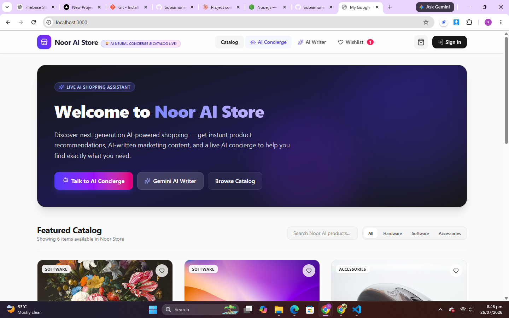
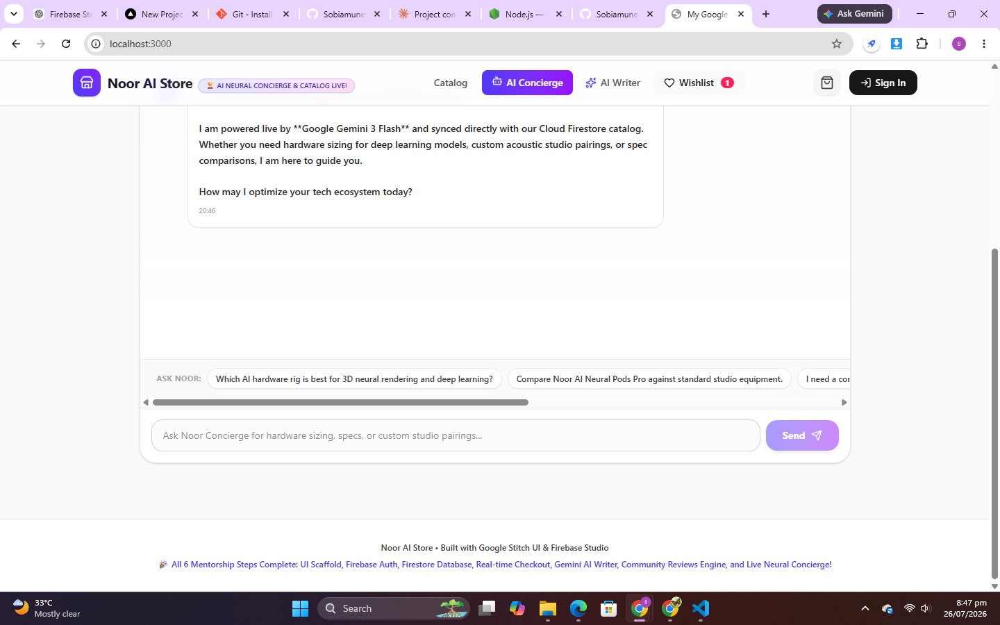
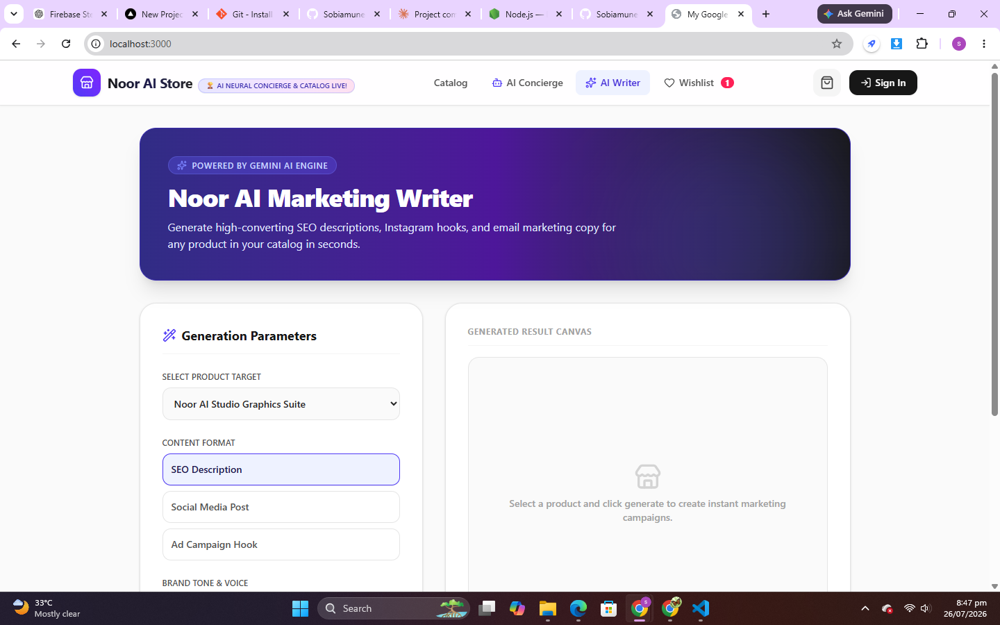
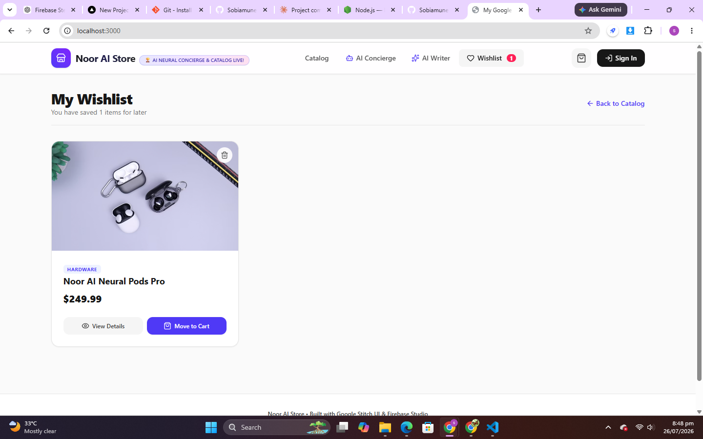

markdown
# 🛍️ Noor ul Haya

## 📌 The Problem

Small online sellers often lack the time, budget, or writing skills to create professional marketing content — product descriptions, ad copy, and social media posts — for their stores. At the same time, customers browsing online stores often feel overwhelmed by choices and don't get instant, personalized guidance on what to buy.

**Noor ul Haya** solves both problems in one platform: it gives sellers an AI copywriter to generate high-converting marketing content in seconds, and gives customers a live AI shopping concierge that recommends products based on their actual needs — using the store's real catalog data.

**Built for:** small online sellers/shopkeepers who need marketing help, and shoppers who want personalized product guidance.

## 🌐 Live Demo

👉 **[https://noor-ai-store.vercel.app](https://noor-ai-store.vercel.app)**

## ✨ Features

- 🛒 **Product Catalog** — Browse hardware, software, and accessories with category filters and live search
- 🤖 **AI Shopping Concierge** — Live chat assistant that recommends real products from the store's catalog based on customer needs
- ✍️ **AI Marketing Writer** — Generates SEO descriptions, social media posts, and ad campaign hooks for any product, in a chosen brand tone
- 📊 **AI Review Summarizer** — Analyzes customer reviews and generates a structured summary of strengths and improvement areas
- ❤️ **Wishlist** — Save favorite products for later
- 🔐 **Authentication** — Sign-in for a personalized experience
- 🔥 **Real-time Database** — Product catalog and data powered by Firebase Firestore

## 🤖 AI Feature — How It Works

Noor ul Haya uses **Google Gemini 3 Flash** for three distinct AI-powered features, each with its own custom instructions:

### 1. AI Shopping Concierge

You are Noor, the futuristic AI Shopping Concierge & Neural Hardware
Advisor. You assist customers in selecting the right AI hardware rigs,
smart neural pods, and interactive experiences.

Here is our live store catalog:
${catalogSummary}

Customer Message: "${message}"

Guidelines:

Be warm, helpful, futuristic, and concise (under 250 words).
When recommending products from our catalog, use their EXACT product names.
This prompt is dynamically injected with the **live product catalog** pulled from Firestore, so recommendations always reference real, in-stock products.

### 2. AI Marketing Writer

You are an expert AI marketing copywriter for 'Noor ul Haya'.

Write high-converting marketing copy with the following parameters:

Product Target: ${product}
Content Format: ${contentType}
Brand Tone & Voice: ${tone}

Requirements:

Make it captivating, scannable, and well-formatted with markdown.
Highlight unique AI capabilities, futuristic engineering, and lifestyle benefits.
Do NOT include any meta-commentary or introductory conversational text.

### 3. AI Review Summarizer

You are the AI Quality & Customer Intelligence Analyst at Noor ul Haya.

Analyze the following customer reviews for "${productName}" and generate
a concise, high-signal summary.

Requirements:

Structure the response with 3 concise sections: What Customers Love,
Constructive Feedback, and an overall verdict.
Use bullet points and bold formatting.
Keep the tone helpful, objective, and professional.

## 🛠️ Tools, Services & Models Used

- **Frontend:** React + Vite + TypeScript, Tailwind CSS
- **Backend:** Express (`server.ts`)
- **Database:** Firebase Firestore
- **Authentication:** Firebase Auth
- **AI Model:** Google Gemini 3 Flash (`@google/genai` SDK)
- **Deployment:** Vercel
- **Version Control:** Git & GitHub

## 📸 Screenshots

### Homepage


### AI Shopping Concierge


### AI Marketing Writer


### Wishlist


## 🚀 How to Run Locally

### Prerequisites
- [Node.js](https://nodejs.org) (v18 or higher)
- A Firebase project with Firestore enabled
- A Google Gemini API key

### Steps

1. Clone the repository
```bash
   git clone https://github.com/Sobiamuneer725/noor-ai-store.git
   cd noor-ai-store
```

2. Install dependencies
```bash
   npm install
```

3. Set up environment variables
   - Copy `.env.example` to `.env`
   - Add your Firebase and Gemini API credentials

4. Run the development server
```bash
   npm run dev
```

5. Open in browser

http://localhost:3000


## 📄 License

This project is open source and available for personal and educational use.

---

**Built with ❤️ using React, Firebase, and Google Gemini AI**